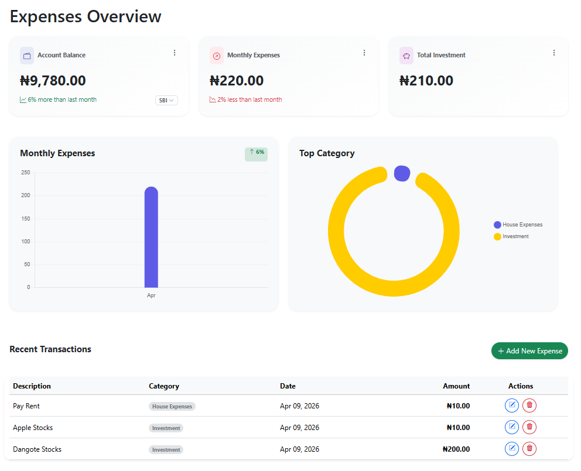

# 🏦 FinanceApp.Web

A robust, modern **Personal Finance Dashboard** built with **ASP.NET Core MVC**. This application enables users to manage multiple accounts, track categorized expenses, and visualize financial health through real-time data analytics.

## 🌟 Key Features

* **Relational Account Management**: Link expenses to specific accounts (e.g., Savings, Salary, Daily Cash) with automated balance updates.
* **Dynamic Data Visualization**: Interactive financial reporting using **Chart.js**, featuring:
    * Monthly expense trends (Bar Chart).
    * Categorized spending breakdown (Doughnut Chart).
* **Calculated State Management**: Custom service logic that ensures data integrity across the database during CRUD operations.

## 📊 Dashboard Preview



---

## 🛠️ Technical Stack

* **Backend**: .NET 8 / ASP.NET Core MVC
* **Database**: SQL Server using **Entity Framework Core**
* **Frontend**: HTML5, CSS3, Bootstrap 5, JavaScript
* **Charts**: Chart.js

---

## Testing
* **Test Framework**: xUnit
* **Mocking Library**: Moq
* **Test Coverage**: Service Layer (Account Balance Logic)


## Getting Started

### Prerequisites
* [.NET 8 SDK](https://dotnet.microsoft.com/download/dotnet/8.0)
* [SQL Server](https://www.microsoft.com/en-us/sql-server/sql-server-downloads) (or LocalDB)

### Installation
1.  Clone the repository:
    ```bash
    git clone https://github.com/Muqeetat/FinanceApp.git
    ```
2.  Update the connection string in `appsettings.json` to point to your SQL Server instance.
3.  Apply migrations to create the database:
    ```bash
    dotnet ef database update
    ```
4.  Run the application:
    ```bash
    dotnet run
    ```